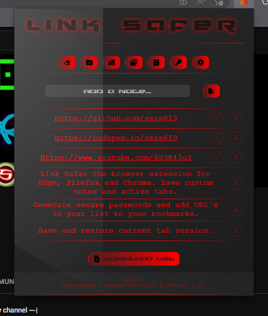
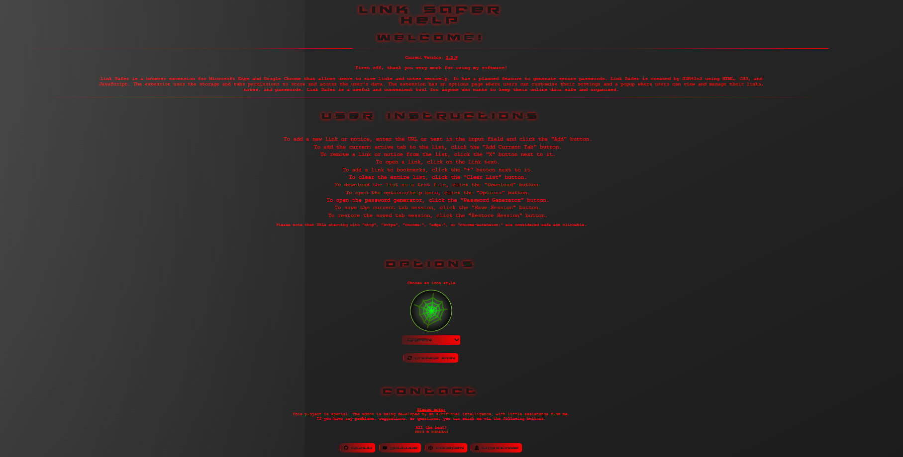
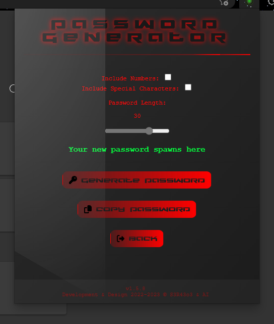

# Link Safer - Edge

Link Safer is a browser extension available for Edge and Chrome that provides a secure and convenient way to manage saved hyperlinks and notes. With this extension, users can perform various actions such as shortening links, opening hyperlinks, deleting saved items, and adding new links.

## Installation

You can easily install the Link Safer extension from the Edge & Chrome Web Store. 

Additionally, a Firefox version is also available for download from the [Firefox store](https://addons.mozilla.org/de/firefox/addon/linksafer/?utm_source=addons.mozilla.org&utm_medium=referral&utm_content=search).

If you prefer to install the extension manually, follow these steps:

    
Manual installation

     

- Go to the [release section](https://github.com/sera619/EdgeAddon/releases) of the extension's GitHub repository.
- Download the latest release.
- Open your browser and navigate to the browser or extension settings.
- Look for the option to install an extension from a file.
- Select the path to the downloaded zip file.
- Click install, and the extension should be ready to use.

## Usage

    
Screenshots

     

- 
- 
- 

 

Once the extension is installed, users can access it through the browser menu. The extension provides a user-friendly interface displaying a list of saved links and notes. Here are some key functionalities:

- **Adding Links**: Users can add new links by entering the URL and clicking on the "Add" button. They can also directly add the currently active tab as a link by clicking on the "Add Current Tab" button.

- **Link Shortening**: Long links can be shortened for better readability. The extension automatically shortens lengthy links and displays them with an ellipsis (...).

- **Opening Links**: By clicking on a hyperlink, users can open the respective link in a new browser tab.

- **Deleting Items**: Saved items can be easily deleted by clicking on the "X" button next to each item.

- **Clearing the List**: The extension provides an option to clear the entire list of saved links and notes. This action removes all items from the list.

## Contributing

Contributions to this project are welcomed. If you encounter any bugs or have suggestions for improvements, feel free to create a pull request on the extension's GitHub repository.

## Authors

This extension was developed and designed by S3R43o3 and AI.

## License

This project is licensed under the [MIT License](LICENSE).
